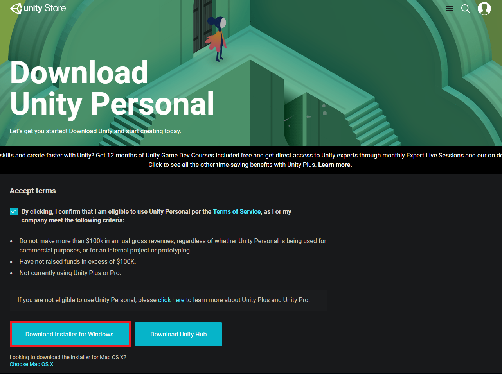
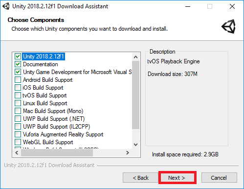
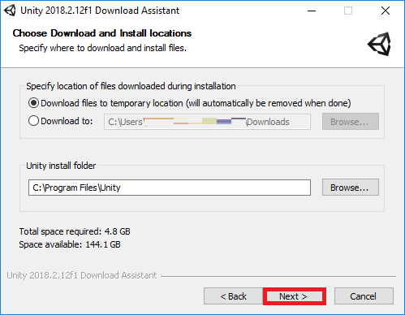
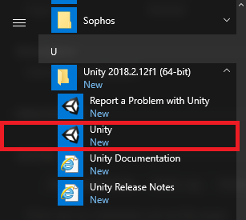
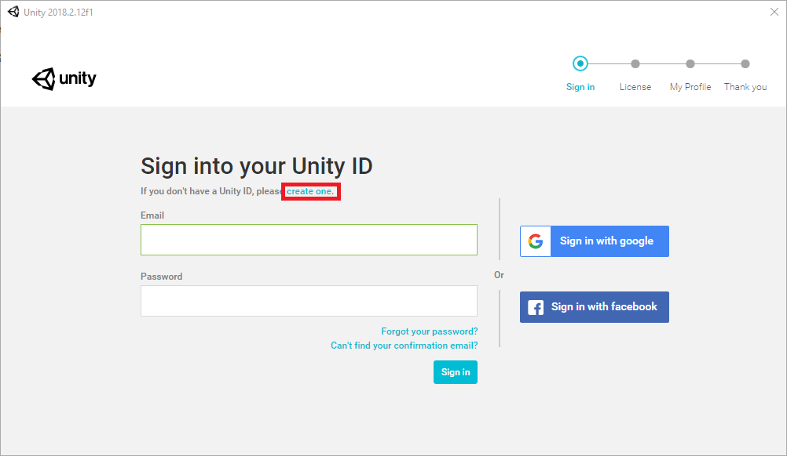
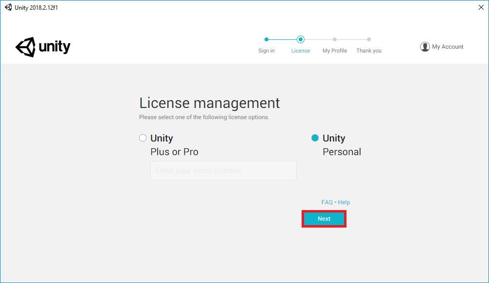

### step1 
前往[unity store](https://store.unity.com/download)下载安装包，由于服务器在国外，所以下载时间较长，要保持网络畅通和耐心等待

### step2
在浏览器下载文件的目录里，找到刚下载好的unity安装助手（exe应用程序），点击进行安装。
如果什么都不懂的话，一直点“next”也可以，但是最好注意一下根据自己的需求和条件，选择安装什么组件和目录。

### step3
安装好后，可以在window开始菜单栏里看到unity,说明你已经安装成功了，但还需要创建账号，认证邮箱。

### step4
最后选择个人版，就可以免费使用啦！

